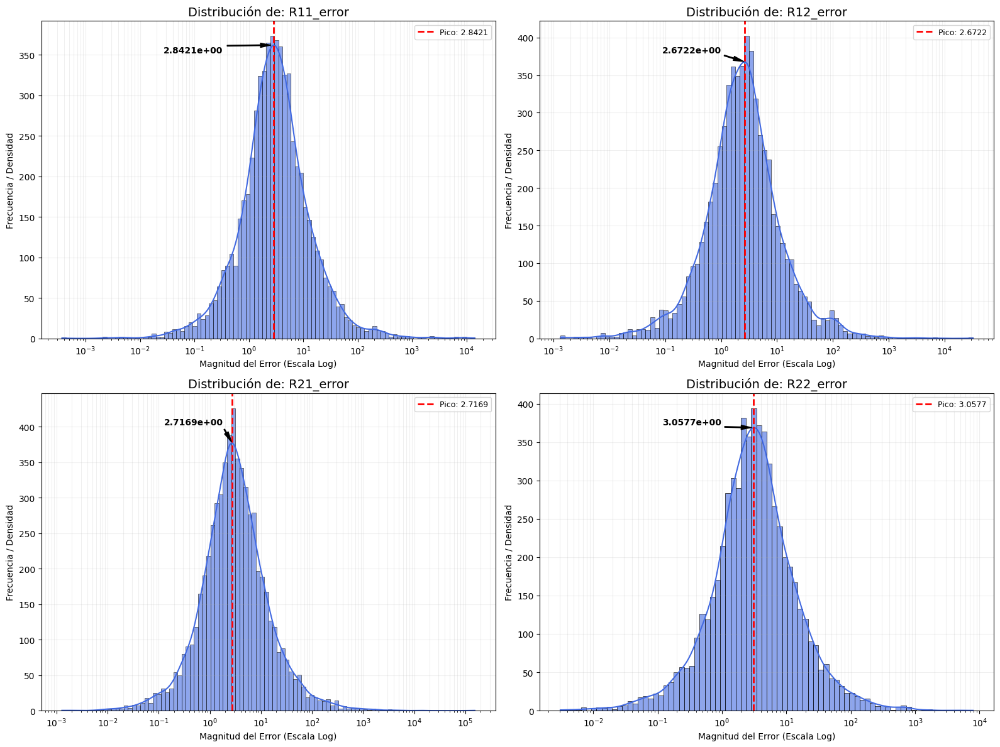
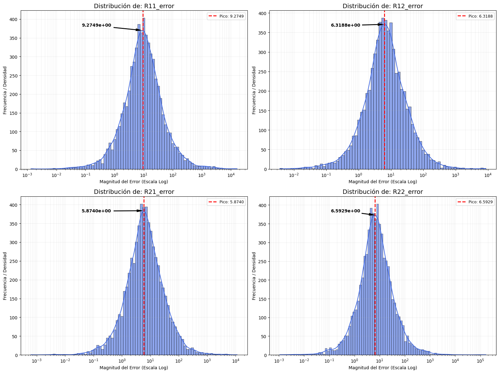
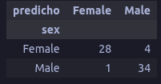
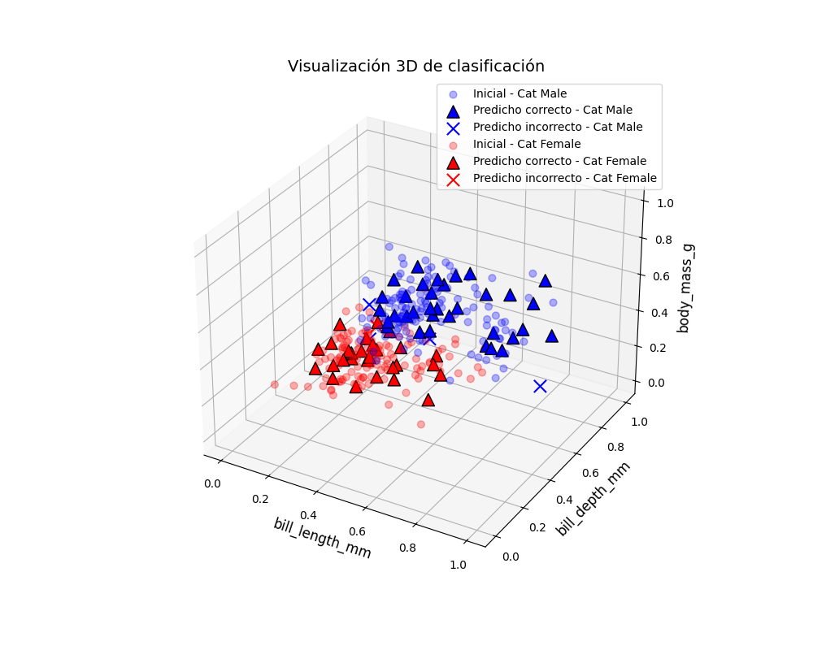
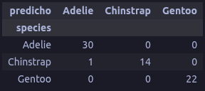
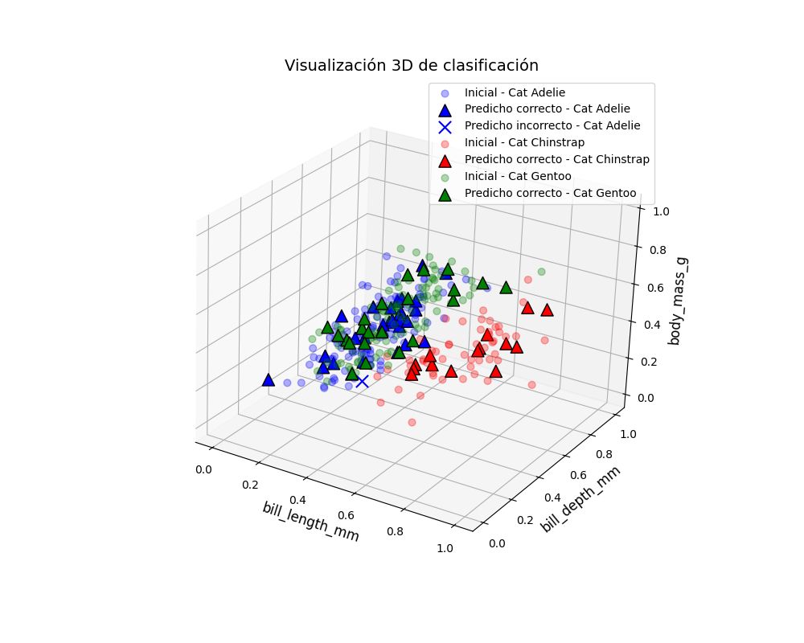

Ejercicios:
### 1. Considere la figura 6.1. Conforme un data set con resultados de 50.000 multiplicaciones de matrices 2 X 2, generadas aleatoriamente con números enteros entre -20 y 20. Una vez entrenado el modelo, úselo con 10 ejemplos y compare los resultados con los que se producen al realizar la operación analíticamente.Haga un cálculo de que es más costoso computacionalmente.

Debido a que el ejercicio requiere la creación de un dataset con resultados de 50.000 multiplicaciones de matrices 2 X 2, generadas aleatoriamente con números enteros entre -20 y 20, se plantea la solución de este ejercicio a partir del uso de dataframes, con el uso de pandas y numpy, se crean las matrices aleatorias (cada columna es un elemento de la matriz) y se realiza la multiplicación de matrices; el resultado de la matriz se divide en 2 datasets para entrenar y testear el modelo.

El código se presenta en dos archivos:
 - [P1_matrix_multiplication_light.ipynb](Codigo/P1_matrix_multiplication_light.ipynb)
 - [P1_matrix_multiplication_Dense.ipynb](Codigo/P1_matrix_multiplication_Dense.ipynb)

En cada uno de ellos, el entrenamiento tiene enfoques diferentes, en el primero, se usa una red neuronal con una sola capa oculta y un entrenamiento intensivo, el cual tarda aproximadamente 2 horas, mientras que en el segundo, se usa una red neuronal con múltiples capas ocultas y un entrenamiento con menor cantidad de epocas, el cual demora una cantidad de tiempo significativamente menor y ofrece un error promedio menor, en un principio puede parecer conveniente usar el segundo enfoque, sin embargo, el primer enfoque ofrece un resultado que demora menos tiempo en alcanzar un valor aceptable de error, sin embargo, el entrenamiento deberia realizarse una unica vez, un modelo con mayor tiempo de entrenamiento, es mas rentable a largo plazo, ya que el tamaño es menor y los resultados similares.

Resultados del modelo denso:

Resultados del modelo ligero:

Al comparar los resultados, la ventaja obtenida durante la prueba del modelo pese a la disminución del tiempo de entrenamiento, es mínima. y el tamaño de cada uno de los modelos exportados, difieren en un factor de 1 a 4, es posible que un entrenamiento mas intensivo del modelo ligero, termine obteniendo un resultado mas aceptable, (el entrenamiento de 5000 epocas tardo 2 horas).

## **En alguno de los siguientes problemas, usar datos de alguna entidad gubernamental.**
### 2. Estudie el algoritmo SVM con todo detalle, mejore su documentación y con base en el haga cambios para una aplicación.
### 3. Estudie el algoritmo de K- Nearest, con todo detalle mejore su documentación y con base en el haga cambios para una aplicación.

Para este ejercicio, se usan los datos de un dataset de seaborn, el cual contiene información sobre tamaños y pesos de diferentes pinguinos, y se plantea el uso de la especie o el sexo como grupo de clasificación.

El archivo **[P3_KNN.ipynb](Codigo/P3_KNN.ipynb)** contiene el desarrollo del ejercicio, en el cual se detallan las funciones y agrupaciones realizadas, donde los puntos de entrenamiento se presentan como círculos claros, las clasificaciones correctas, como triangulos, y las clasificaciones erroneas como 'x' oscuras.

Se presentan los resultados de la clasificación del sexo del pingüino, con 7 vecinos, en donde se presenta una falsa clasificación de 5 pingüinos.

**Los ejes de las graficas estan normalizados**

Y adicionalmente, la clasificción por especie, en donde se tienen 3 especies, con un unico error de clasificación.

**Los ejes de las graficas estan normalizados**

### 4. Estudie el algoritmo de árboles de decisión, con todo detalle mejore su documentación y con base en el haga cambios para una aplicación.

Para el desarrollo del código en Python no se utilizó una librería externa para la obtención de datos, sino que se generó un conjunto de datos sintético mediante la librería NumPy y se organizó utilizando pandas.

El algoritmo de Árbol de Decisión es un modelo de aprendizaje supervisado usado en clasificación y regresión, que organiza decisiones en forma de árbol con nodos (condiciones), ramas (decisiones) y hojas (resultados). 

Funciona dividiendo los datos en subconjuntos más homogéneos usando criterios como el índice Gini o la entropía. Es popular por su fácil interpretación y se aplica en áreas como créditos, diagnóstico médico y segmentación de clientes. En este trabajo se implementó con datos normalizados y se evaluó con una matriz de confusión y visualización de resultados. Estos fueron los resultados, en el cual se presenta una falsa clasificacion de 9.

Una representacion 3D seria el siguiente:

Como mejora, se propone ajustar la profundidad del árbol para evitar sobreajuste y considerar métodos más robustos como Random Forest.

El codigo se presenta en el siguiente archivo:
[P4_ARBOL.ipynb](Codigo/P4_ARBOL.ipynb)

### 5. Estudie el algoritmo de Bayes ingenuo y haga un ejemplo bien documentado. De los últimos 4 ejercicios haga 3. Nuevamente, si tiene otro problema que le parezca interesante en el que se use ML, lo puede cambiar, por uno de los ejercicios planteados.
